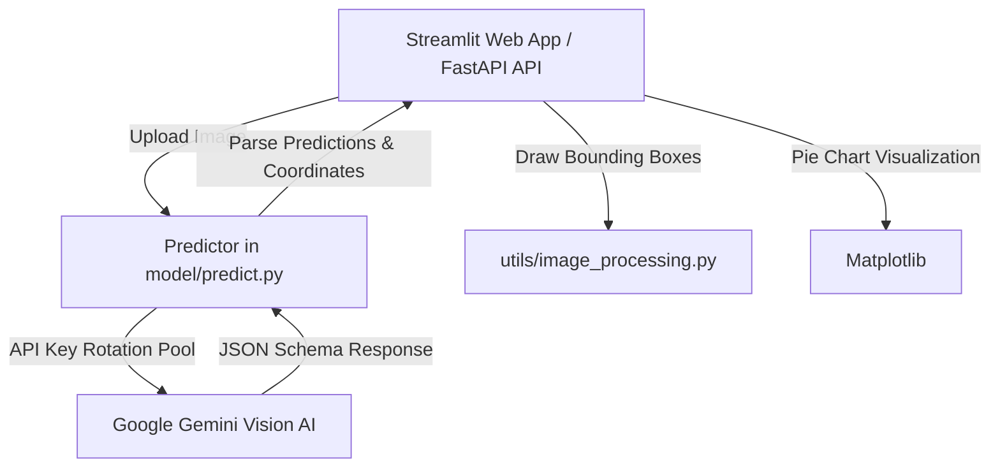

# 🍽️ Project Analysis & Proposed Features

An analysis of the **Multimodal Food Nutrition Analyzer** codebase has been completed. Below is an overview of the current architecture, potential areas of improvement, and five detailed feature proposals that can elevate the application from a simple demo to a premium, feature-rich health tracker.

---

## 🔍 Current Architecture Overview

### Key Strengths of Current Implementation:
1. **Robust Object Detection:** Leverages Google's `gemini-2.5-flash` model, enabling high-fidelity multimodal recognition of arbitrary food items (e.g., multi-item meals, complex gravies, side dishes) that are hard to capture with traditional computer vision models.
2. **Reliable Key Rotation:** The `ApiKeyRotator` class manages a fallback pool of Gemini API keys, avoiding downtime if quotas are exceeded.
3. **Clean APIs:** Seamless separation between the interactive Streamlit dashboard and programmatic FastAPI endpoints.

---

## 💡 Proposed Features

Here are five key feature enhancements. They are designed to be modular and built on top of the existing API/Streamlit architecture.

---

### 1. Interactive Meal Correction & Custom Portion Adjuster

> [!NOTE]
> Currently, the nutritional values returned by Gemini are static estimations. If a portion size is misidentified (e.g., detecting one slice of bread instead of two, or estimating a smaller portion of rice), the overall calculation becomes inaccurate.

#### How it works:
- Display the detected items as editable input fields or a slider-based interface.
- Allow users to:
  - Adjust portion sizes using scaling factors (e.g., `0.5x`, `1.0x`, `1.5x`, `2.0x`).
  - Edit macro numbers directly if they have exact details.
  - Add missing items manually from a search box or custom input.
  - Delete false-positive detections.
- Automatically recalculate total calories, proteins, fats, and carbs in real-time as the fields are adjusted.

#### Implementation Scope:
- Modify [app_streamlit.py](file:///c:/Users/Administrator/OneDrive/Desktop/FA/app_streamlit.py) to replace the static table with editable controls (e.g., `st.number_input` or a dynamic data editor component).

---

### 2. Daily Caloric Goal & Personal History Tracker

> [!IMPORTANT]
> A health tracker is far more valuable when it aggregates intake over time. Currently, meals are analyzed in isolation and forgotten once the page is refreshed.

#### How it works:
- **Daily Targets:** Allow users to set daily targets for Calories (e.g., 2000 kcal), Protein (130g), Carbs (220g), and Fat (65g) in a sidebar settings menu.
- **Log Meal Button:** Add a button to save the current meal to a local lightweight database (SQLite) or a JSON file.
- **Daily Dashboard:**
  - Show progress bars comparing **Today's Total Intake** against **Target Goals**.
  - Color-code progress bars (e.g., green for meeting target, amber for close, red for exceeding).
- **History Log:** Add a collapsible section showing historical meals logged, with dates, times, and micro-nutrient summaries.

#### Implementation Scope:
- Create a new module `utils/db_manager.py` to handle SQLite interactions.
- Update [app_streamlit.py](file:///c:/Users/Administrator/OneDrive/Desktop/FA/app_streamlit.py) to display the daily metrics dashboard and progress bars.

---

### 3. Gemini AI Dietitian Coaching & Nutritional Feedback

> [!TIP]
> Raw numbers can be hard to interpret. An AI-powered nutrition coach can translate calories/macronutrients into actionable dietary recommendations.

#### How it works:
- Under the meal analysis, add an **"AI Dietitian Recommendations"** panel.
- Send a request to Gemini containing the list of detected foods and macros.
- Prompt the model to return structured feedback:
  - **Meal Balance Rating:** (e.g., "Protein-deficient", "Well-balanced", "High fat").
  - **Dietary Insights:** Explain the nutritional profile (e.g., glycemic impact, fiber, healthy fats).
  - **Recommendations:** Actionable tips to improve the meal (e.g., "To balance this meal, consider adding 150g of low-fat yogurt or a side salad to increase fiber and protein.").

#### Implementation Scope:
- Add a new helper method in [model/predict.py](file:///model/predict.py) to query Gemini for advice based on macro totals.
- Render feedback in Streamlit using a stylish card/alert system.

---

### 4. Premium Aesthetic UI/UX & Glassmorphic Food Cards

> [!TIP]
> A premium dashboard aesthetic makes food tracking a more engaging experience. Streamlit can be styled with custom HTML/CSS injections to look like a modern dashboard.

#### How it works:
- Inject a custom stylesheet `assets/custom_style.css` containing dark-mode friendly CSS variables.
- Display each detected food item as a individual **Visual Food Card** instead of a flat table row. Each card will contain:
  - The food label and estimated portion.
  - Mini tags for each macronutrient (Protein, Carbs, Fat) with distinct, vibrant colors.
  - Hover zoom effects.
- Use styled progress meters for macro distributions.

#### Implementation Scope:
- Create `assets/custom_style.css`.
- Modify [app_streamlit.py](file:///c:/Users/Administrator/OneDrive/Desktop/FA/app_streamlit.py) to load custom CSS and render cards with HTML.

---

### 5. Multi-Meal Comparison & PDF Meal Report Exporter

> [!NOTE]
> Users often want to compare different meal options (e.g., Meal Prep A vs. Meal Prep B) or export their records to share with a trainer or doctor.

#### How it works:
- **Comparison Tab:** Add a split-screen option where users can upload two meals side-by-side and compare calorie densities, macro distributions, and AI ratings.
- **Export Report:** Add a button to export the analyzed meal (including image, annotated boxes, macros, and AI feedback) as a PDF report or raw CSV log.

#### Implementation Scope:
- Add PDF generation utility (e.g., `reportlab` or a clean HTML-to-PDF compiler).
- Modify Streamlit to support multi-image upload toggles.
